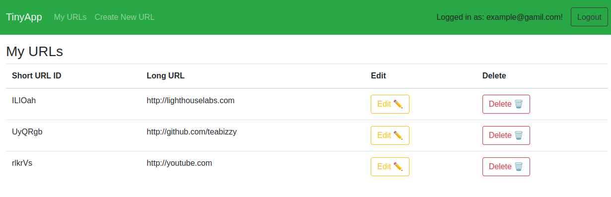
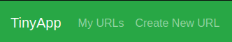
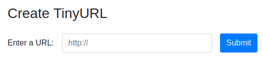
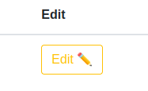
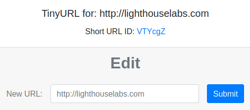
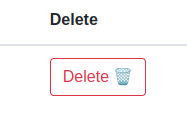
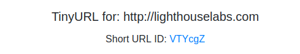

<!-- PROJECT LOGO -->
<div align="center">
  <a href="https://github.com/TeaBizzy/tinyapp">


  
  </a>

# TINY APP

<div align="center">
  A web application that allows users to create, edit, and share shortened urls.
  <div>
    <a href="https://github.com/TeaBizzy/tinyapp/issues">Report Bug</a>
    ·
    <a href="https://github.com/TeaBizzy/tinyapp/issues">Request Feature</a>
  </div>
</div>
<br />

<!-- ABOUT THE PROJECT -->
## About The Project



---
### Built With

<a href="https://expressjs.com/">Express</a> : 
<a href="https://getbootstrap.com/">Bootstrap</a> : 
<a href="https://ejs.co/">EJS</a> : 
<a href="https://github.com/expressjs/cookie-session">Cookie-Session</a> : 
<a href="https://github.com/kelektiv/node.bcrypt.js/">bcryptjs</a>

<div align="left">

---

<!-- GETTING STARTED -->
## Getting Started

### Prerequisites

* npm
* node

### Installation

1. Clone the repo
   ```sh
   git clone https://github.com/teabizzy/tinyapp.git
   ```
2. Install NPM packages
   ```sh
   npm install
   ```

### Accessing the Website

1. Start the server
  ```sh
  npm start
  ```
2. Open your browser, and enter the following url
  ```
  http://localhost:8080/
  ```

---
<!-- USAGE EXAMPLES -->
## Usage

* Register a new account, or login to an existing one.
* NOTE: The server doesn't keep it's state after shutting down. All databases will be reset.

### Create New URL

1. Click 'Create New Url' in the header
<br/>



2. Enter a valid url into the input field. NOTE: Must include http://
<br/>



3. Submit!

---

### Edit URL

1. Click the 'Edit' button for the URL you want to change
<br/>



2. Enter the new URL into the input field. NOTE: Must include http://
<br/>



3. Submit!

---

### Delete URL

1. Click the 'Delete' button for the URL you want to remove
<br/>



---

### Use the Short URL

### Method 1
1. Click the 'Edit' button for the link you want to use

<br/>


2. Click the blue short url
<br/>



### Method 2
* Enter the short url into the browser with the following template:

```
http://localhost:8080/u/<short url code>
```

### Example:
```
http://localhost:8080/u/VTYcgZ
```

---

<!-- CONTACT -->
## Contact

Stefan Talbot - satalbot@protonmail.com

Project Link: [https://github.com/TeaBizzy/tinyapp](https://github.com/TeaBizzy/tinyapp)

---

<!-- ACKNOWLEDGMENTS -->
## Acknowledgments

* [Light House Labs](https://www.lighthouselabs.ca/)